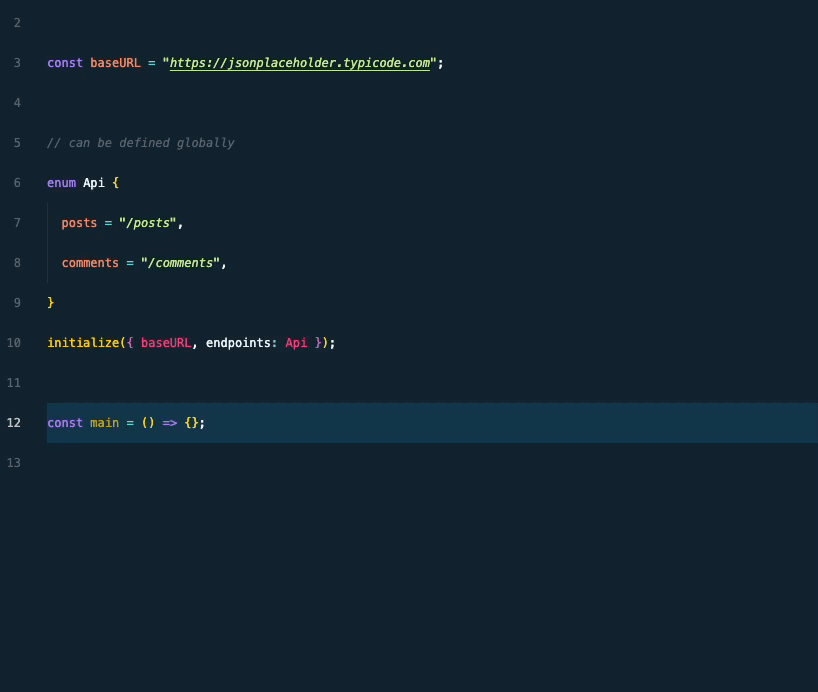
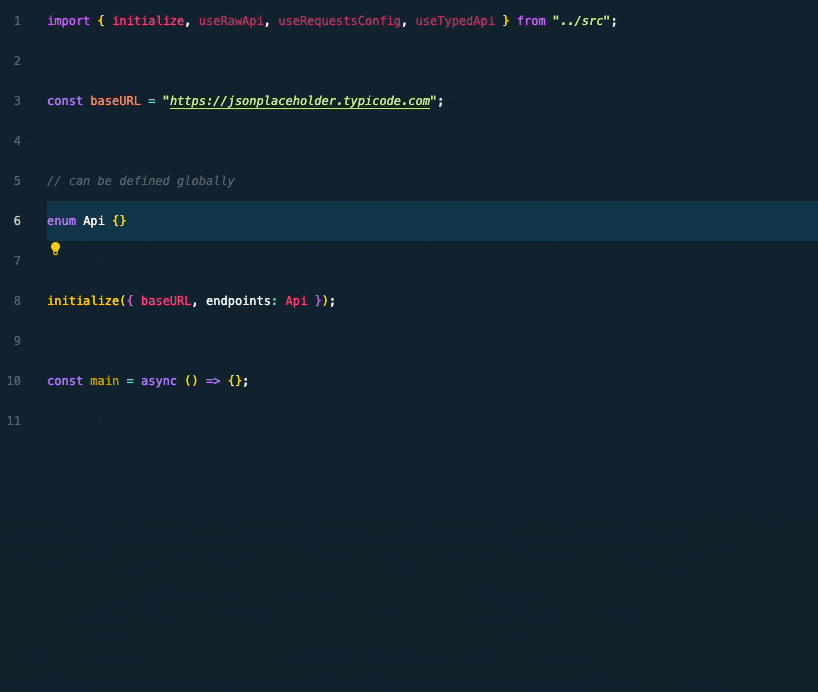

<div align="center">
	<br>
	<br>
	
	<br>
	<br>
	<br>
	<br>
</div>

**Support questions should be asked [here](https://github.com/frangeris/use-typed-api/discussions).**

> Type-Safe HTTP client hook helper to handle requests based on native fetch api with some magic under the hood ✨.


## Install

> [!CAUTION]
> This package is still in development and not ready for production use.

```sh
npm install use-typed-api
```

## Get started

This module provides a lightweight abstraction for making API requests in TypeScript, with a focus on defining and using REST API endpoints efficiently. The module offers a clean, type-safe way to handle HTTP requests using predefined endpoints.

Some key features:

- ✨ Type-safe API endpoint handling.
- ⚡️ Easy initialization with API base URL and endpoints.
- 🦾 Simplified request logic with _GET_, _POST_, and other HTTP methods via [fetch](https://developer.mozilla.org/en-US/docs/Web/API/Fetch_API/Using_Fetch) API.

## Usage

To begin using the API request module, you need to initialize it by specifying the base URL of your API and defining the endpoints you'll be working with (there is an option for `raw` request we will cover later). This setup ensures that all subsequent API requests are made to the correct URLs with consistent endpoint handling.

First, you’ll need to import the necessary functions.

- The `useTypedApi` function is the core hook for making requests.
- While `initialize` is for setting up the configuration for your API requests and can be called from anywhere in your app when bootstraping the app.

Here's how you import them from the module:

```ts
import { initialize, useTypedApi, useRawApi } from "use-typed-api";
```

Then, you'll define your API endpoints using an [enum](https://www.typescriptlang.org/docs/handbook/enums.html). This `enum` acts as a centralized way to declare all the routes your API supports. It also helps ensure that requests are type-safe, meaning you'll get compile-time checks for correct usage:

```ts
export enum Api {
  users = "/users",
  userById = "/users/:id",
}
```

Each key in the enum represents a different API route. These routes can contain dynamic parameters (e.g., `:id`), which are replaced by actual values when making requests.

Now, we need to initialize by using the `initialize` function. This function requires two arguments plus others that are optional:

- **Base URL**: The root URL where your API is hosted (`e.g. https://api.example.io/dev`).
- **Endpoints**: The enum you defined earlier, which specifies your available API routes.

```ts
initialize("https://api.example.io/dev", { endpoints: Api });
```

In above example:

- `https://api.example.io/dev` is the base URL of the API.
- Passing the enum as value for `endpoints` config option ensures that all the endpoints defined in the `Api` enum are passed to the initialization function.

By setting up this initialization, you ensure that every request you make using the `useTypedApi` hook will automatically target the correct API with the predefined endpoints.

The [fetch options](https://developer.mozilla.org/en-US/docs/Web/API/Window/fetch#options) to customize the request are also supported via the second argument of the `init` function, eg:

```ts
init("https://api.example.io/dev", {
  endpoints: Api,
  headers: new Headers({ "Cache-Control": "must-revalidate" }),
```

Other available global options can be set via the `useRequestConfig` hook, we will cover this later.

### Escape path parameters

In the `Api` enum, you can define dynamic path parameters by prefixing them with a colon (`:`). For example, the `userById` endpoint has a dynamic `:id` parameter, which can be replaced with an actual value when making requests.

But what if you need to use a literal colon in your path, such as `/users:top`? You can escape the colon by _escaping it_ with a double backslash `\\`, like this:

```ts
topMessagesByUser = `/users/:id/messages\\:top`,
// it will hit /users/1/messages:top
```

This way, the colon will be treated as a literal character in the path, rather than a dynamic parameter.

### ⚡️ Now, let's make some calls

Once the module is initialized, you can easily make requests to the defined endpoints. Here's quick snippet:

```ts
import { initialize, useTypedApi, useRequestConfig } from "use-typed-api";

type User = {
  name: string;
};

export enum Api {
  users = "/users",
  userById = "/users/:id",
}

initialize("https://api.example.io/dev", { endpoints: Api });

const main = async () => {
  const { userById } = useTypedApi<typeof Api>();

  // the returned structure is the same as the fetch Response object
  // so json, ok, body, blob, bytes, headers, status, text, statusText are available
  const t = await userById.get<User>({ params: { id: 1 } });
};
main();
```

> [!NOTE]
> The `data` property is also available, but there are some caveats we will discuss later.

All HTTP methods expect two optional parameters: `path:? RequestPath, options:? RequestInit`, which can be used to customize the request path, query strings, and options are directly passed to the native fetch method, for example:

Adding another part to the URL, used for extends the endpoint:

```ts
const { users } = useTypedApi<typeof Api>();
await users.get({ path: "/test", query: { id: "1" } });
// will request to https://api.example.io/dev/users/test?id=1
```

---

Based on the above example, the `useTypedApi` hook returns an object with methods for each endpoint defined in the `Api` enum. You can then call these methods to make requests to the corresponding API routes.

### Only registered endpoints are available

If you try to access an endpoint that isn't defined in the `Api` enum, TypeScript will throw a compile-time error. This ensures that you only use the correct endpoints and helps prevent runtime errors.



### Type-safe request handling

The `useTypedApi` hook provides methods for each endpoint defined in the `Api` enum. These methods are type-safe, meaning that the parameters you pass to them are checked against the expected types defined in the `Api` enum. This ensures that you're using the correct parameters for each endpoint and helps prevent runtime errors.



The response of all methods is an instance of [fetch Response](https://developer.mozilla.org/en-US/docs/Web/API/Response) object, which you can use to extract `status, headers, json(), text()`, etc.

> [!WARNING]
> Any parameters defined in the endpoint definition are required when calling the method. If you omit a required parameter, TypeScript will throw a compile-time error or an exception will be thrown at runtime.

### `data` property

The `data` property is a helper that allows you to extract the JSON response from the fetch response object, it's a wrapper that _in case that **data** property exists_ in the `json` response so will be casted to the generic type used as generic when making the request eg: `await users.get<User[]>()`

#### Caveats

1. The property is not populated automatically, you need to call it explicitly in a asynchronous way.
2. `data` key needs to be present on the response, otherwise, it will return `null`.
3. The `data` property returns a promise so `await` is required when accessing it.

Here's an example of how to use the `data` property, given the following JSON response for `GET /users`:

```json
{
  "data": [
    {
      "id": 1,
      "name": "John Doe"
    }
  ]
}
```

```ts
const { users } = useTypedApi<typeof Api>();
const { data } = await users.get<User[]>();
console.log(await data); // [{ id: 1, name: "John Doe" }]
```

The `await` keyword is used to extract the JSON response from the fetch response object and cast it to the generic type `User[]` in runtime, so it will be available only when requested, otherwise and others scenarios when needs the direct manipulation of the response object, you can use the fetch response object directly.

### Raw requests

In some cases, you may need to make requests that don't correspond to any of the predefined endpoints. For these cases, you can use the `useRawApi` hook, which provides a way to make raw requests to any URL.

The `useRawApi` hook returns an object with methods for making requests using the `fetch` API. You can use these methods to make requests to any URL, with full control over the request path, query strings, headers, and other options.

When using raw requests, global shared options are not applied, here's an example of how to use the `useRawRequests` hook:

```ts
const raw = useRawApi();
const r = await raw("https://myapi.io").get();
// GET https://myapi.io
```

### Headers

There is a way to customize headers for all requests, you can use the `useRequestConfig` hook to set headers, options, and other configurations for all requests.

The `useRequestConfig` function allows you to customize options, including headers following the standard [Headers](https://developer.mozilla.org/en-US/docs/Web/API/Headers) API specification.

All headers are shared across all requests, so you only need to set them once. For example, you can set an authorization token for all requests and will be used for all subsequent requests, eg:

To use `useRequestConfig`, you first need to import it from the module:

```ts
import { useRequestConfig } from "use-typed-api";

const { headers } = useRequestConfig();
const { users } = useTypedApi<typeof Api>();
headers.set("Authorization", "Bearer <token>");
// ...
const t = await users.get<User[]>();
```

This sets the `Authorization` header for all requests made using the `useTypedApi` hook.

> [!NOTE]
> All request from now on will use this header while the instance is alive

By using `useRequestConfig`, you can easily customize headers and other request options (future) on a per-request basis, providing flexibility and control over your API interactions.

## Interceptors

Interceptors provide a powerful mechanism to hook into the request/response lifecycle, allowing you to execute custom logic at critical stages of HTTP communication. They act as middleware that can observe, modify, or react to requests and responses globally across your application.

This feature is particularly valuable for cross-cutting concerns that need to be applied consistently across all API calls without duplicating code in each request. Common use cases include centralized logging, authentication token management, error handling, performance monitoring, and request/response transformation.

### Available interceptors

The module provides three interceptor hooks that cover the complete request lifecycle:

- **`onRequest`**: Invoked immediately before a request is sent to the server. This is your opportunity to inspect or modify outgoing requests, add custom headers, log request details, or implement request validation.

- **`onResponse`**: Called after receiving a successful response from the server. Use this to process response data, update application state based on server responses, log successful operations, or trigger analytics events.

- **`onError`**: Triggered when an error occurs during the request. This includes network failures, timeout errors, or any exceptions thrown during the fetch operation. Perfect for centralized error handling, retry logic, or user notification systems.

### Configuration

Interceptors can be configured in two ways: during the initial setup when you call `initialize`, or dynamically at runtime using the `useRequestsConfig` hook. Both approaches are equally valid, and you can choose based on whether your interceptor logic is static or needs to change during the application lifecycle.

#### During initialization

When you know your interceptor logic upfront and it won't change during runtime, you can configure interceptors directly in the initialization call:

```ts
initialize({
  baseURL: "https://api.example.io/dev",
  endpoints: Api,
  interceptors: {
    onRequest: (request) => {
      console.log(`Sending: ${request.method} ${request.url}`);
    },
    onResponse: (response) => {
      console.log(`Received: ${response.status}`);
    },
    onError: (response, error) => {
      console.error(`Failed: ${error.message}`);
    },
  },
});
```

#### Runtime configuration

For more dynamic scenarios where you need to set up interceptors after initialization, or when the interceptor behavior depends on runtime conditions, use the `useRequestsConfig` hook:

```ts
const { interceptors } = useRequestsConfig();

interceptors.onRequest = (request) => {
  console.log(`Sending: ${request.method} ${request.url}`);
};
```

Once configured, interceptors will automatically apply to all subsequent requests made through `useTypedApi`.

### Practical examples

#### Request logging and monitoring

One of the most common uses of interceptors is to maintain a comprehensive audit trail of all API interactions. You can log every request and response, which is invaluable for debugging, analytics, and monitoring application behavior:

```ts
interceptors.onRequest = (request) => {
  logger.info(`API Call: ${request.method} ${request.url}`);
};

interceptors.onResponse = (response) => {
  logger.info(`Response: ${response.status} from ${response.url}`);
};
```

This approach ensures that every API call is tracked without having to add logging code to each individual request.

#### Authentication and token management

Interceptors excel at handling authentication concerns globally. For example, you can automatically detect when an authentication token has expired (typically indicated by a 401 status) and trigger a token refresh flow:

```ts
interceptors.onError = async (response, error) => {
  if (response?.status === 401) {
    const newToken = await refreshAuthToken();
    headers.set("Authorization", `Bearer ${newToken}`);
  }
};
```

This pattern ensures that authentication is handled consistently across your entire application, and users experience seamless re-authentication without manual intervention.

#### Centralized error handling

Rather than handling errors individually for each request, interceptors allow you to implement a single, consistent error handling strategy. You can categorize errors, show appropriate user messages, and log issues to error tracking services:

```ts
interceptors.onError = (response, error) => {
  if (response?.status === 500) {
    showNotification("Server error. Please try again later.");
  } else if (response?.status === 404) {
    showNotification("Resource not found.");
  }

  errorTracker.log({ error, url: response?.url, status: response?.status });
};
```

#### Performance tracking

Interceptors can work together to measure request performance. By recording timestamps in `onRequest` and calculating duration in `onResponse`, you can track API performance across your application:

```ts
const timings = new Map();

interceptors.onRequest = (request) => {
  timings.set(request.url, Date.now());
};

interceptors.onResponse = (response) => {
  const duration = Date.now() - timings.get(response.url);
  console.log(`${response.url} took ${duration}ms`);
};
```

### Important considerations

When working with interceptors, keep in mind several important behaviors and limitations:

**Global scope**: Interceptors are applied globally to all requests made through `useTypedApi`. This means any interceptor you configure will affect every API call in your application, which is powerful but requires careful consideration of the logic you implement.

**Raw requests**: Interceptors are **not applied** to raw requests made with `useRawApi`. This is by design, as raw requests are meant to provide complete control without any middleware interference.

**Error handling**: The `onError` interceptor receives both the response object (when available) and the error that occurred. The response might be `null` in cases of network failures or request cancellation, so always check for its existence before accessing response properties.

**Request modification**: While you can technically modify the request object in `onRequest`, be cautious as these changes affect the actual request being sent. This capability is useful for adding headers or modifying URLs, but improper modifications could break requests.

**Execution order**: Interceptors run synchronously in the request/response flow. The `onRequest` interceptor completes before the request is sent, and `onResponse` or `onError` complete before the response is returned to your code.

## Why `use-typed-api`?

In modern web development, working with APIs is a common requirement, but it often comes with challenges such as:

- Boilerplate code: Repeating the same request logic for every API call.
- Hard-coded endpoints: Scattering API URLs and endpoints throughout your code, making it difficult to maintain and prone to errors.
- Lack of type safety: Incorrect or inconsistent endpoint usage often isn't caught until runtime, leading to more bugs and harder debugging.
- Manual query and param handling: When working with REST APIs, you often need to manage dynamic path parameters (`:id`, `:userId`, etc.) and query strings (`?id=1`) manually.

This module addresses these challenges by offering a _Type safety for API requests_ following strict typing for your endpoints, ensuring that the routes, parameters, and query strings are used correctly at compile-time.

By using an enum to define all endpoints in one place, it becomes easier to update, maintain, and reuse API routes without worrying about inconsistent URL usage across your codebase.

Making request handling via the `useTypedApi` hook abstracts away much of the boilerplate required for making HTTP requests, allowing you to focus on the logic of your application instead of the details of constructing API calls.

As your API grows, you can simply add more routes to the Endpoints enum and have them immediately available across your project without rewriting any request logic.

Made with ❤️ by [frang](https://github.com/frangeris)
